<!DOCTYPE html>
<html lang="en">
<head>
  <meta charset="UTF-8">
  <meta name="viewport" content="width=device-width, initial-scale=1.0">
  <title>Luxora Hotel</title>
  <link rel="stylesheet" href="style.css">
  <!-- Font Awesome Icons -->
  <link rel="stylesheet" href="https://cdnjs.cloudflare.com/ajax/libs/font-awesome/6.5.0/css/all.min.css">
</head>
<body>

<header>
  <!-- TOP BAR -->
  

     

        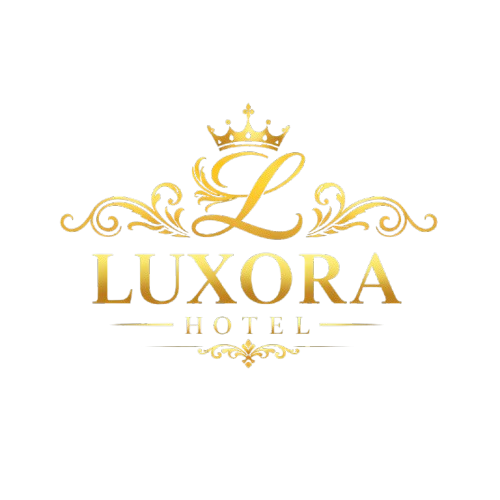
     

     

        <i class="fa-solid fa-location-dot"></i>
        Jalan Stesen Sentral 5, KL Sentral, 50470 Kuala Lumpur
     

     

        <i class="fa-solid fa-envelope"></i>
        <a href="mailto:info@luxorahotel.gmail.my">info.luxorahotel@gmail.com.my</a>
     

     

        <i class="fa-brands fa-whatsapp"></i>
        <a href="https://wa.me/60179326582">+601 7932 6582</a>
     

  

  

  <!-- NAVBAR -->
  <nav class="nav-bar">
     <a href="main.html" class="active">HOME</a>
     <a href="book.html">ROOMS</a>
     <a href="dinner.html">RESTAURANT</a>
     <a href="facilities.html">FACILITIES</a>
     <a href="events.html">EVENTS</a>
     <a href="contact.html">CONTACT US</a>
     <a href="about.html">ABOUT US</a>
  </nav>

  

</header>

<!-- BOOKING BAR -->

  

    

      <input type="text" id="checkInInput" placeholder="Check In" readonly>
      <input type="text" id="checkOutInput" placeholder="Check Out" readonly>

      

        

          <button class="nav" id="prevMonthBtn">‹</button>
          
          <button class="nav" id="nextMonthBtn">›</button>
        

        

          

            SunMonTue
            WedThuFriSat
          

          

        

        

          <button id="calendarResetBtn">Reset</button>
          <button id="calendarDoneBtn" class="done">Done</button>
        

      

    

    

      <button id="btnRooms" class="btnRooms">
        <i class="fa fa-user"></i>
        1 ROOM, 1 ADULT, 1 CHILD
      </button>
      

        

          Room
          <button id="roomMinus">-</button>
          1
          <button id="roomPlus">+</button>
        

        

          Adult
          <button id="adultMinus">-</button>
          1
          <button id="adultPlus">+</button>
        

        

          Children
          <button id="childMinus">-</button>
          1
          <button id="childPlus">+</button>
        

        <button id="roomDone" class="done-btn">DONE</button>
      

    

    <button class="availability">
      <a href="book.html"> AVAILABILITY</a>
    </button>
  

<!-- BIG IMAGE -->

  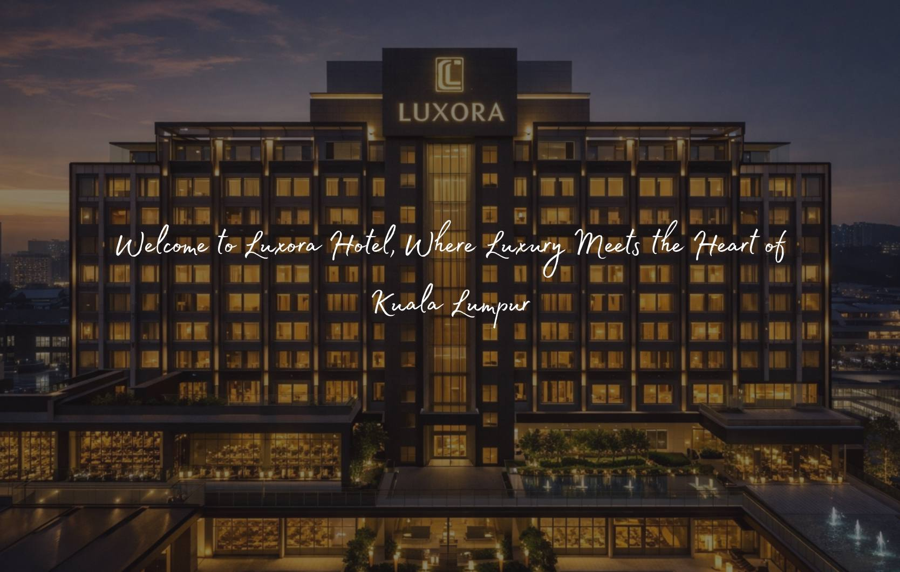

<!-- INFORMATION CONTAINER -->

  

    <button id="PrevBtn"><i class="fa-solid fa-chevron-left"></i></button>
    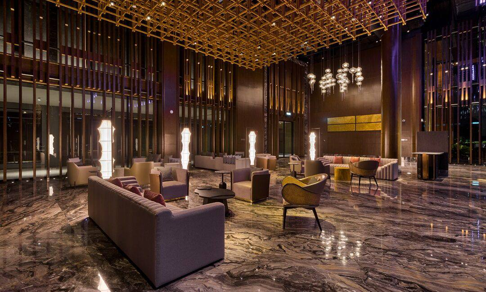
    <button id="NextBtn"><i class="fa-solid fa-chevron-right"></i></button>
  

  

    <h1>EXPERIENCE, COMFORT, EMBRACE LUXURY</h1>
    <h5>Luxora Hotel is a luxury hotel in the heart of Kuala Lumpur, built in 1980 and beautifully modernized for today's travelers. 
      Located near KL Sentral, it offers stylish rooms, premium comfort, and easy access to the city's main attractions.
      Luxora Hotel combines timeless elegance with modern luxury for a memorable stay.</h5>
  

<!-- ANOTHER INFORMATION -->

  

    
    <h3>CLIMATE</h3>
    
Tropical

  

  

    
    <h3>CURRENCY</h3>
    
Ringgit Malaysia (RM)

  

  

    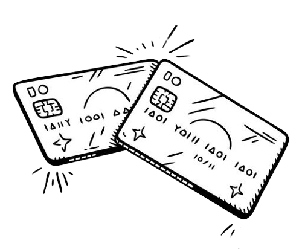
    <h3>CREDIT CARD</h3>
    
All Major Credit Card Accepted

  

  

    
    <h3>PARKING</h3>
    
Complimentary for In-House Guests

    
(Except for valet parking service)

  

<!-- GUEST CONTAINER -->

  <h1>GUEST ROOM</h1>
  <h5>Just Like Home, Only Better!!</h5>
  

    

      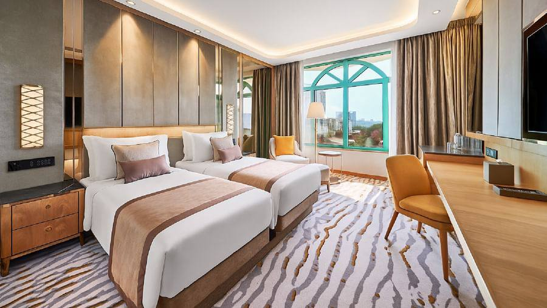
      <h1>TWIN DELUXE ROOM</h1>
      <h5>A perfect base with the essentials for a snug stay.</h5>
      <button class="viewBtn"><a href="room2.html">VIEW MORE</a></button>
    

    

      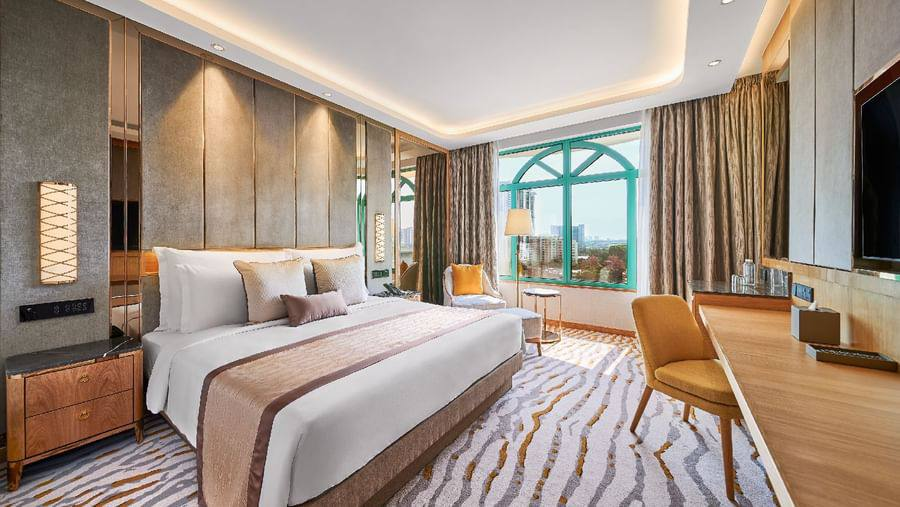
      <h1>KING DELUXE ROOM</h1>
      <h5>A sanctuary for comfort and simplified luxury.</h5>
      <button class="viewBtn"><a href="room1.html">VIEW MORE</a></button>
    

    

      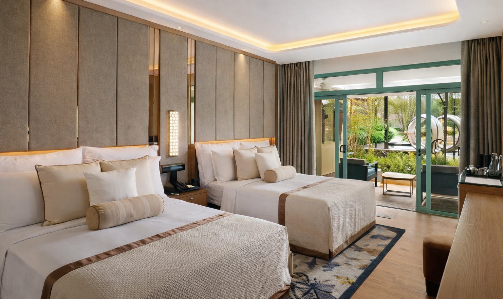
      <h1>SUPERIOR ROOM</h1>
      <h5>A cosy haven with discrete opulence.</h5>
      <button class="viewBtn"><a href="room3.html">VIEW MORE</a></button>
    

    

      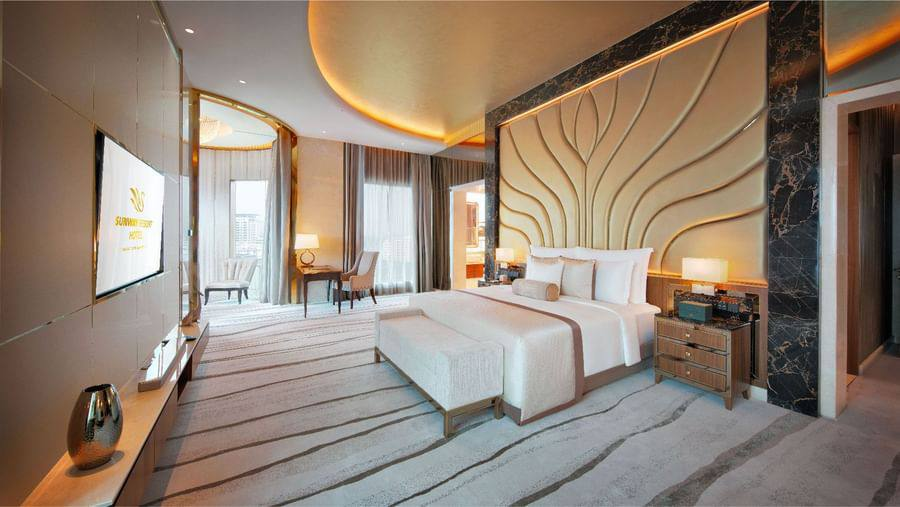
      <h1>PRESIDENTIAL SUITE</h1>
      <h5>Distinctively designed and exquisitely appointed.</h5>
      <button class="viewBtn"><a href="room4.html">VIEW MORE</a></button>
    

  

<!-- MAP CONTAINER -->

  

    <h1>GETTING HERE</h1>
    <h2>LUXORA HOTEL & SUITES</h2>
    <h5>Jalan Stesen Sentral 5, KL Sentral, 50470 Kuala Lumpur</h5>
    <h5><strong>E-mail:</strong> info@luxorahotel.gmail.com</h5>
    <h5><strong>Tel:</strong> +601 7932 6582</h5>

    <!-- Accordion -->
    

      <button class="drop-btn">Train</button>
      
<h5>Kuala Lumpur Sentral Phileo Damansara MRT</h5>

    

    

      <button class="drop-btn">Airport</button>
      
<h5>          
          Kuala Lumpur International Airport (KLIA) 
          Distance from property: 57.3 KM  
          Kuala Lumpur International Airport 2 (KLIA2) 
          Distance from property: 59.7 KM  
          Sultan Abdul Aziz Shah Airport (SkyPark) 
          Distance from property: 16.2 KM</h5>

    

    

      <button class="drop-btn">Bus</button>
      
<h5>Terminal Bersepadu Selatan Kuala Lumpur Sentral</h5>

    

    

      <button class="drop-btn">Parking Rate</button>
      
<h5>
          Parking Rates / Per Day  
          Grace Period - 15 minutes 
          Guest (Outlet / Event) - RM 9 
          Heavy Vehicle - RM 25  
          Valet Parking - RM 30 Per Entry / Per Day  
          Clamping - RM 100 
          KGPA Members with Sticker - Complimentary 
          Motorcycle - Complimentary
      </h5>

    

  

  

    <iframe src="https://www.google.com/maps/embed?pb=!1m18!1m12!1m3!1d3983.8576661614993!2d101.6849033!3d3.1322910999999998!2m3!1f0!2f0!3f0!3m2!1i1024!2i768!4f13.1!3m3!1m2!1s0x31cc49c100206e3f%3A0xca9e7285c7ea9d1e!2sJalan%20Stesen%20Sentral%205%2C%2050470%20Kuala%20Lumpur!5e0!3m2!1sen!2smy!4v1767959214853!5m2!1sen!2smy" width="600" height="450" style="border:0;" allowfullscreen="" loading="lazy" referrerpolicy="no-referrer-when-downgrade"></iframe>
  

<!-- ATTRACTIONS -->

  <button type="button" class="slide-btn left" id="slideLeftBtn">❮</button>
  

    

      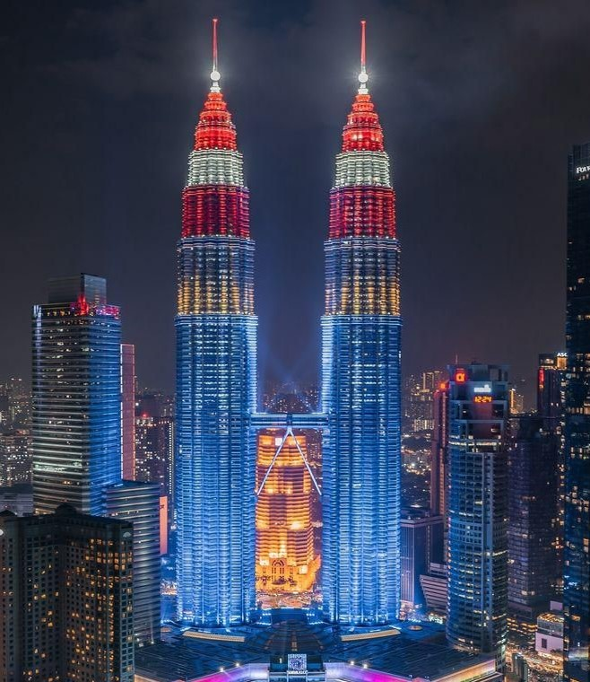<h4>Petronas Twin Towers</h4>
      <h6>City views</h6>
    

    

      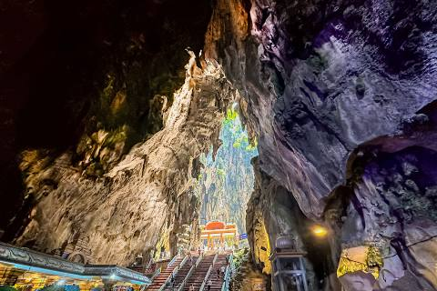
      <h4>Batu Caves</h4>
      <h6>Hindu shrines</h6>
    

    

      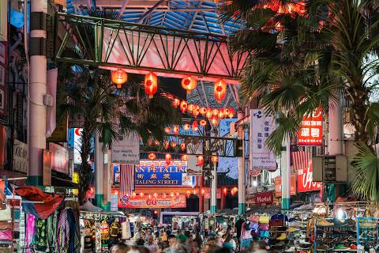
      <h4>Food Market</h4>
      <h6>Local spices & crafts</h6>
    

    

      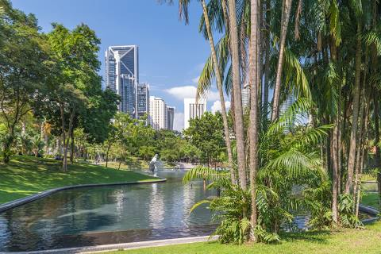
      <h4>KLCC Park</h4>
      <h6>Lush gardens</h6>
    

    

      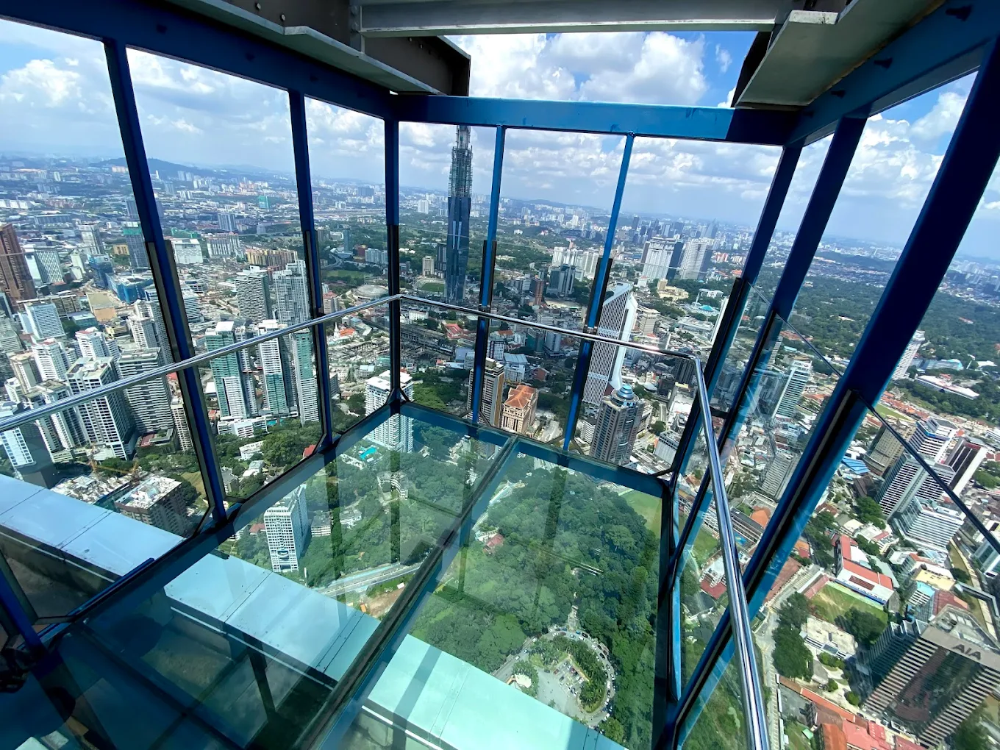
      <h4>City Views</h4>
      <h6>Kuala Lumpur Skyline</h6>
    

    

      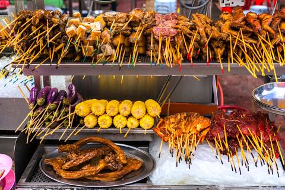
      <h4>Street Food</h4>
      <h6>Malaysian dishes</h6>
    

  

  <button type="button" class="slide-btn right" id="slideRightBtn">❯</button>

<!-- FOOTER -->

  <nav class="nav-bar">
     <a href="main.html">HOME</a>
     <a href="book.html">ROOMS</a>
     <a href="facilities.html">FACILITIES</a>
     <a href="events.html">EVENTS</a>
     <a href="contact.html">CONTACT US</a>
  </nav>
  

  

    

      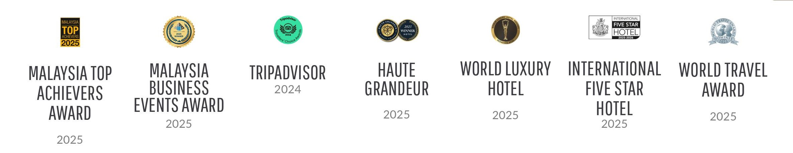
    

    

      <h1>FIND US!</h1>
      
<i class="fa-brands fa-whatsapp"></i><a href="https://wa.me/60179326582">+601 7932 6582</a>

      
<i class="fa-solid fa-envelope"></i><a href="mailto:info@luxorahotel.gmail.my">info@luxorahotel.gmail.my</a>

      
<i class="fa-solid fa-location-dot"></i>Jalan Stesen Sentral 5, KL Sentral

      

        <a href="#"><i class="fa-brands fa-instagram"></i></a>
        <a href="#"><i class="fa-brands fa-facebook-f"></i></a>
        <a href="#"><i class="fa-brands fa-x-twitter"></i></a>
      

    

  

<!-- ScrollTopBtn -->
<button id="scrollTopBtn">&#8679;</button>

<!-- GALLERY MODAL -->

  

    ✕
    

  

</body>
</html>
